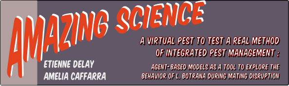
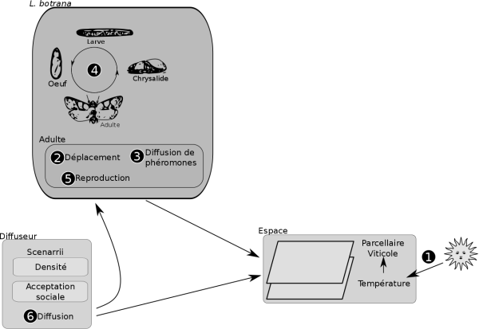
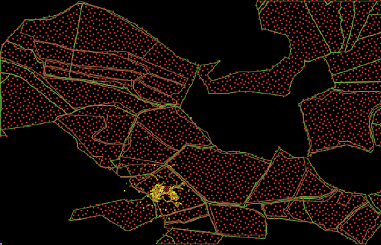
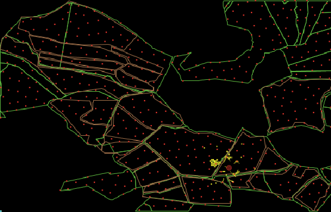
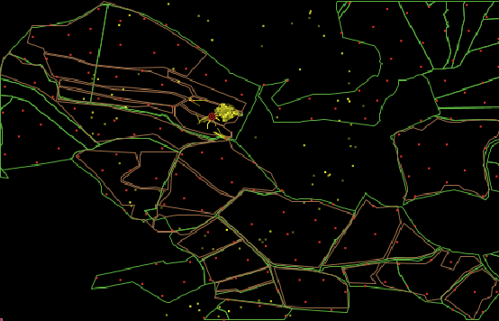
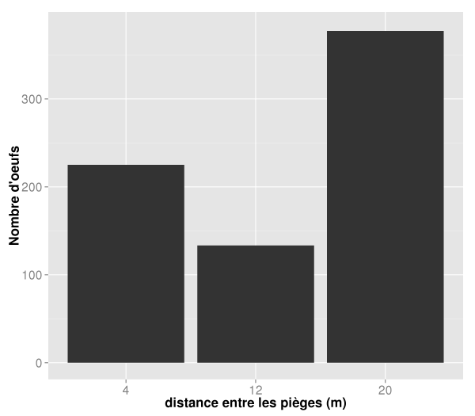
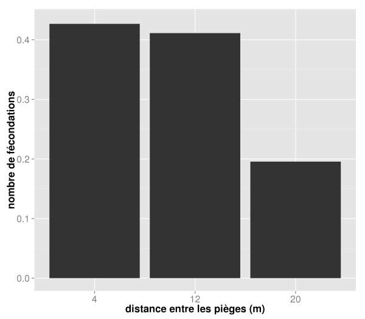
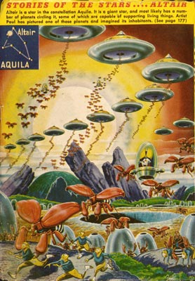
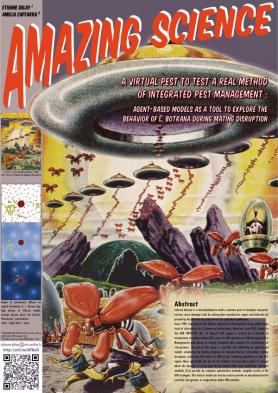

# A virtual pest to test a real method of integrated pest management:  agent-based models as a tool to explore the behavior of L. botrana during mating disruption.

# Un ravageur virtuel pour expérimenter des méthodes réelles de lutte intégrée : l'utilisation de modèle à base d'agents pour explorer les comportements de L. Botrana pendant la confusion sexuelle.

[Etienne DELAY](http://geolab.univ-bpclermont.fr/spip.php?article184)1 & [Amelia CAFFARRA](http://www6.montpellier.inra.fr/lepse/Equipes/ETAP/Non-permanents/Amelia-Caffarra)2

1 Laboratoire GEOLAB UMR 6042 CNRS Université de Limoges, FLSH, 39E rue Camille Guérin 87036 Limoges, France. Email : etienne.delay[at]etu.unilim.fr

2 CAP Alpha, Avenue de l’Europe 34830 Clapiers, France

*__Abstract__*

*Lobesia botrana is a microlepidoptera moth a common pest in European vineyards. Larvaes cause damages both by eating plant reproductive organs and indirectly by promoting the infection of grape berries by saprophytic pathogens.
Since 1999, the Banyuls and Albères Agricultural Development Group (GDA) keeps track of infestations by L. botrana on control plots. Moreover, since 2012, thanks to [LIFE ADVCLIM](http://terviclim.in2p3.fr/), the  of Banyuls AOC region is covered by a network of temperature recording stations.*

*This year, the GDA launches an IPM (Integreted Pest Management) plan based on mating disruption that requires the involvement of vine-growers. The aim of this paper is two-fold: the calibrating an agent-based models simulating the mating behavior of Lobesia botrana wih/without mating disruption,  evaluating the impact of IPM on the L.botrana population on the AOC region . More specifically, the aim of this model is I) to provide a proof of concept about the benefits of using agent-based model rather than traditional statistical methods, ii) to provide, by computer optimization methods, tangible results in the IPM strategies. This kind of model can also be used to provide an educational tool to sensitize vine-growers or cooperatives about IPM methods.*

*__Keyword__: integreted pest management, agent-based model, pest, Lobesia botrana,*

__Résumé__

Lobesia botrana, communément appelée eudémis est un microlépidoptère hétérocères, ravageur du vignoble européen, dont les larves engendrent des dégâts directs en se nourrissant des organes reproducteurs de la plante, ou en favorisant les infections au niveau des baies de raisin par des pathogènes saprophytes.
Depuis 1999, le Groupement de Développement Agricole (GDA) du cru Banyuls et des Albères effectue un suivi de l'infestation par la L. Botrana des témoins. Par ailleurs, depuis 2012, grâce à [LIFE ADVCLIM](http://terviclim.in2p3.fr/), le cru est doté d'un maillage de capteurs de température.

Depuis cette année, le GDA se lance dans la lutte intégrée par confusion sexuelle. Pour être efficace ce type de lutte nécessite l'adhésion des viticulteurs sur des surfaces conséquentes. Dans ce travail, nous aborderons deux points : la calibration du modèle individu-centré et l'impact du maillage territorial des pièges à phéromones sur la population de L. Botrana. L'enjeu de ce modèle est i)de fournir une preuve des apports de la modélisation multi-agents sur les méthodes statistiques traditionnelles, ii) de fournir, par des méthodes d'optimisation informatique, des résultats concrets des stratégies de lutte. Par ailleurs, le modèle peut aussi permettre de proposer un outil pédagogique pour sensibiliser les viticulteurs ou les caves coopératives aux méthodes de lutte intégrée.

__Mots-Clés__ : lutte intégrée, systèmes multi-agents, ravageur, Lobesia botrana

*__Software__ : we used [Netlogo 5.1.0](http://ccl.northwestern.edu/netlogo/5.1.0/) as agents-based model framework (Wilensky, 1999), [R](http://www.r-project.org/) (R Core Team 2014) for statistical analysis with several packages : plyr (Wickham, 2011), reshape2 (Wickham, 2007), and ggplot2 (Wickham, 2009).*

## Introduction

Lobesia botrana, communément appelée eudémis est un microlépidoptère hétérocères multivoltin, ravageur du vignoble européen, dont les larves engendrent des dégâts directs en se nourrissant des organes reproducteurs de la plante, ou en favorisant les infections au niveau des baies de raisin par des pathogènes saprophytes. 
Comme la plupart des espèces de l'ordre Lepidoptera , l'accouplement des L. botrana procède d'une « parade » dans laquelle la femelle libère des phéromones qui déclenchent sur les mâles un comportement de recherche (Briand, 2009 ; Schmitz, 1992). Les phases de développement de L. botrana étant largement liées aux variations climatiques, un certain nombre de travaux propose des modèles mathématiques permettant de « prédire » les dates des vols d'adultes à partir de données de température (Bovey, 1966 ; Logan *et al.*,1976).

Si les dégâts peuvent être observés sur les jeunes pousses ou les organes de reproduction, c'est au moment de la véraison que les dégâts (ponte de la 3e génération) sont le plus dommageables pour les viticulteurs. En effet, une fois écloses, les larves vont percer le pédicule pour se nourrir de la pulpe, ouvrant la voie aux maladies cryptogamiques (oïdium, mildiou, etc). 

Depuis 1999, le Groupement de Développement Agricole (GDA) du cru Banyuls et des Albères effectue un suivi de l'infestation par L. botrana sur des parcelles témoins et, depuis 2013, effectue des expérimentations de lutte par confusion sexuelle sur des îlots de culture identifiés comme « problématiques ». Par ailleurs, depuis 2012, grâce à [LIFE ADVCLIM](http://terviclim.in2p3.fr/), le cru est doté d'un ensemble de capteurs relevant la température toutes les 10 minutes. Nous disposons donc de données de température journalisées et de comptages d'individus piégés, ce qui nous permet d'étudier plus précisément les dynamiques de diffusion de L. botrana.

Les études autour de L. botrana se sont multipliées depuis les années 80. Parmi celles-ci, la modélisation occupe une large proportion dédiée à l'étude de l'impact des différentes variables sur l'évolution des populations (Logan *et al.*, 2006 ; Damos et Savopoulou-Soultani, 2010 ; Amo-Salas *et al.*,2011 ; Ainseba *et al.*, 2011 ; He et Ainseba, 2014). Toutefois, seules quelques références concernent les processus de diffusion ou d'évolution dans l'espace, mais sur des territoires très étendus, de plusieurs centaines de kilomètres carrés (Sáenz-de-Cabezón *et al.*, 2011 ; Caffarra *et al.* 2012). Il s'agira dans ce travail de comprendre ces processus à l'échelle de la parcelle ou de l'îlot de culture.
Dans le monde des systèmes multi-agents, le cas de L. botrana n'est pas abordé spécifiquement, mais on trouve des travaux d'exploration des processus de diffusion de ravageurs (Rebaudo et Dangles, 2013), d'espèces envahissantes (Cacho *et al.*, 2010) ou de maladies (Banos et al 2014).

L'implémentation, à l'échelle des individus, des divers mécanismes a-spatialisés dans un modèle agents nous permet d'intégrer de-facto l'espace, et ainsi délimiter, par la formalisation, les limites des connaissances que nous avons pu implémenter dans le modèle. Nous apportons dans ce papier un éclairage sur la description et l'ordonnancement des processus qui entrent en jeu dans une approche systémique des interactions au vignoble entre l'espace, la plante, les parasites et les viticulteurs. Ce modèle propose d'explorer : i) la place de l'espace dans la modélisation de l'infestation, ii) l'optimisation des techniques de lutte par phéromones en fonction de l'échelle de réflexion.

## Matériel et méthodes
### Entités, variables, échelles

Dans le modèle CELL, nous avons implémenté 3 types d'agents : les agents eudémis (L. botrana), l'espace constitué d'une grille de cellules et les pièges à phéromones. La cellule est l'unité spatiale de référence représentant 2 m2 , dont l'agrégation va constituer les parcelles viticoles. Enfin, dans les simulations sur les méthodes de lutte par confusion sexuelle, nous avons introduit des agents trap (diffuseurs de phéromones).

La vie de L. botrana s'organise en 4 phases (œufs, larve, chrysalide, adulte) que nous intégrons au comportement des agents virtuels. De plus, nous devons assigner aux agents un lot d'attributs : âge en phase adulte et sexe qui différencieront leur comportement dans le modèle. La série d'attributs notée a, b ,c, t vont permettre aux agents de se développer en fonction de leur environnement (Logan *et al.* 1976 ; Cossu et al, 1999). Les femelles sont dotées d'un « drapeau » qui les empêche de s'accoupler quand elles sont en gestation et d'un compteur de temps de gestation.

Au niveau de l'espace virtuel, les cellules de la grille ont comme attribut : le fait d'être ou non viticoles, le cépage qui est planté sur la parcelle. Si elles sont confusées, nous devons également fixer le moment de la floraison de la vigne, le cumul thermique, le volume de phéromones issues des agents eudémis, le volume de phéromones dégagées par les agents trap. 

L'espace de modélisation se focalise sur une zone sur laquelle des comptages sont effectués depuis 1999 par le GDA du cru Banyuls et des Albères. Cette zone de 9 hectares en bordure occidentale de l'[AOC banyuls](http://en.wikipedia.org/wiki/Banyuls_AOC) fait partie depuis 2013 du réseau d'expérimentation sur la confusion sexuelle mené par le GDA. L'espace sur lequel nous travaillons dans le modèle mesure 5km2 et contient la zone de confusion ainsi que des parcelles non confusées. 

Depuis 2012, un capteur de température du réseau de [LIFE ADVCLIM](http://terviclim.in2p3.fr/) est installé sur la zone étudiée et permet d'obtenir des relevés de température précis (infrajournalier). Nous avons décidé que chaque itération du modèle représentera une journée.
Dans ce modèle, nous nous intéressons aux conséquences des mouvements des lépidoptères sur les possibilités d'accouplement.

### Processus et Ordonnancement

Les types de processus qui entrent en jeu dans ce modèle ont trait aux cellules, aux agents L. botrana, et aux diffuseurs de phéromones. Nous nous intéressons ici à l'enchainement des processus (c.f. fig. 0 : "scheduling"):

 * processus liés aux cellules : 
    * la température est mise à jour grâce aux relevés de terrain effectués avec le capteur de [LIFE ADVCLIM](http://terviclim.in2p3.fr/) présent sur la zone ;
* processus liés aux agents Lobesia : 
     1.Déplacement : si les agents sont en phase adulte, ils vont pouvoir se déplacer de 8 m avec des objectifs différents selon le sexe. 
     1. Phéromones : les agents adultes femelles diffusent des phéromones sur les cellules rencontrées. 
     1. Phase d'évolution : mises à jour des variables si les agents ont changé de phase. 
     1. Cycle de vie : évolution entre les différents stades physiologiques des Lobesia. 
     1. Reproduction : fécondation et dépôt des œufs si les conditions sont réunies.
 * processus liés aux diffuseurs de phéromones : 
    * diffusion des phéromones des pièges de proche en proche

*Figure 0* : scheduling des processus modélisé

### Initialisation, réplication et variables de forçages

À l'initialisation le modèle est forcé par les données des moyennes journalisées des températures spatialisées sur le Cru Banyuls. Chaque jeu de paramétrage est répliqué 35 fois pour s'assurer d’une stabilité des résultats en sortie de modèle et effectuer les analyses de sensibilité.

La calibration du modèle a été faite en se basant sur la littérature pour les variables accessibles en condition expérimentale et pattern-oriented (Grimm *et al.* 2005) pour les variables difficiles à évaluer en condition expérimentale (distance de sensibilité aux phéromones, nombre d’œufs par ponte, etc.) et qui sont donc approchées empiriquement par simulation. Nous avons exploré des configurations de simulation mettant en jeu l'îlot confusé par le GDA depuis 2014 (fig. 1) avec des diffuseurs de phéromones installés à différentes distances les uns des autres. On considère ici que la lutte est organisée à l'échelle de tous les îlots, et que la densité de diffuseur est homogène sur toutes les parcelles.

 a  b  c

*Figure 1* : Effect of the density of pheromone traps (red dots) distribution on spatial distribution of L. botrana  (yellow dots) . a. High density situation (4 m distance between traps). b. Medium density situation (12 m). c. High density (20 m distance) 

## Résultats
La densité des diffuseurs de phéromones sur l'îlot confusé joue un rôle dans la capacité de développement de la population d’insectes. La figure 2 (a) présente le nombre d’œufs début août. Là encore, on peut constater que la lutte par phéromones a réduit d'un facteur 10 le nombre d’œufs par rapport aux situations sans lutte (c.f. tab. 1). Lorsque les diffuseurs de phéromones sont espacés de 20 mètres, le grand nombre d’œufs est dû à l'existence de zones moins chargées en phéromones  ce qui augmente la probabilité d'accouplements entre papillons mâles et femelles, tandis que la situation à haute densité de pièges produit des rencontres aléatoires. Il est alors intéressant de noter que le nombre d’œufs qui va produire la 3e génération de parasites est la plus faible quand la densité est intermédiaire (10 mètres entre chaque piège). Phénomène qu'on retrouve également sur la figure 2 (b).

|Variables|Observations|
|---------|-----------|
|Nombre d'agents|6049.8|
|Nombre de Fécondation|0.82|
|Nombre d'oeufs|2531.7|
|Surfaces touchées|223.6 m2|

*Table 1* : Average values of the indicators of pest pressure in a situation without mating disruption

Le nombre de fécondations (fig 2 (b)) subit par les femelles est divisé par 2, voire par 3 entre la situation avec et sans diffuseur (tab. 1 vs fig. 2). La différence entre les situations à 4, 12 et 20 mètres permet d'imaginer les effets du comportement différencié entre mâles et femelles. En situation normale, la femelle une fois accouplée cherche à déposer sa ponte dans une cellule avec un faible nombre d'agents Lobesia, tandis que le mâle cherche pendant toute sa vie adulte (16j) la source des phéromones. Quand la densité de pièges est haute, les mâles ne sont plus capables de déterminer les zones plus chargées en phéromones, rendant leur déplacement aléatoire. Cela entrave les dynamiques de dispersion « consciente ». Si, par contre, on arrive à des densités de diffuseur de phéromones plus faibles, les mâles auront tendance à se regrouper autour des diffuseurs, tandis que les femelles, une fois fécondées, auront tendance à s'en éloigner. Comme ces dernières ne sont pas capables de chercher les zones de densité de mâles pour se reproduire, cela réduit les chances de fécondation (fécondation multiple).

 a  b

*Figure 2* : Effect of the distribution density of pheromone traps on the (a) average number of eggs and the (b) average number of mating events for each female on the 15th August.

##Discussion 
### Optimisation
Si la lutte intégrée par diffuseurs de phéromones fait peser un coût économique non négligeable sur le milieu viticole, l'espacement des diffuseurs au regard des résultats de la modélisation peut permettre d'optimiser des méthodes de lutte et leur coût. Dans les cas que nous avons simulés, nous montrons qu'une distance de 12 mètres entre chaque diffuseur est optimale pour réduire significativement le nombre d’œufs. Or, si une distance de 2 mètres entre diffuseurs implique de disposer en moyenne de 3569 diffuseurs dans notre monde simulé, une distance de 12 mètres n'en requiert en moyenne que 494.8.

De plus, un trop grand nombre de diffuseurs est contre-productif pour réduire le nombre d'agents en 3e génération et économiquement trop onéreux. Dans cet article nous n'avons pas intégré les caractéristiques réelles des diffuseurs, mais ce type de modèle présente un avantage pour l'industrie chimique afin de tester numériquement ses produits avant la mise sur le marché.

### *Proof of concept*
Ce travail de modélisation à base d'agents permet sans difficulté d'introduire l'espace dans le modèle proposé par Logan *et al.* (1976). Mais introduire l'espace dans un modèle a-spatiale nécessite inévitablement un certain nombre de formalismes supplémentaires notamment autour de variables telles que la distance de visibilité des phéromones, la distance de vol. D'autres variables, largement documentées en condition de laboratoire (comme le nombre d’œufs par ponte), sont toutefois difficilement envisageables en plein champ. Ce type de modèle nous permet d'approcher par la simulation pattern-oriented des valeurs plus proches de ce qui pourrait se produire en plein champ.

Par ailleurs, l'intégration de l'espace ouvre des perspectives particulièrement intéressantes à plusieurs niveaux de la filière : à l’intention des viticulteurs pour faciliter la visualisation du développement des populations d'insectes à l’échelle de leurs parcelles (fig. 1) ; à l'intention des techniciens agricoles, par la mise en place de campagne de lutte intégrée spatialisée.

## Conclusion 
La démarche de lutte intégrée est un processus collectif où les manquements individuels pèsent sur le groupe de manière assez complexe. En effet, les viticulteurs n'ont individuellement pas intérêt à pratiquer la lutte intégrée si leurs voisins le font, mais les parcelles non confusées risquent de devenir des niches pour le parasite et ainsi mettent en péril à la fois l'efficacité de la lutte et l'ensemble de la récolte. Nous voyons ici l'effet d'une lutte homogène sur tout le bassin versant, mais il serait également intéressant d'explorer des configurations spatiales où la lutte s'effectue à l'échelle de la parcelle, créant de-facto un effet de bord où les doses de phéromones des parcelles voisines se chevauchent. Nous pourrions, de même, tester l'évolution du nombre de parasites dans les niches créées par les viticulteurs qui refusent d'intégrer la pratique collective. Ce modèle est donc particulièrement intéressant en tant que tel pour les problèmes de formalisme qu'il soulève, mais d'un point de vue opérationnel gagnerait à y voir intégrer des informations expertes sur les points que nous avons estimés numériquement.

## Référence 
Ainseba, B., Picart, D., Thiéry, D., 2011. *An innovative multistage, physiologically structured, population model to understand the European grapevine moth dynamics*. Journal of Mathematical Analysis and Applications 382, 34–46. doi:10.1016/j.jmaa.2011.04.021

Amo-Salas, M., Ortega-López, V., Harman, R., Alonso-González, A., 2011. A new model for predicting the flight activity of Lobesia botrana (Lepidoptera: Tortricidae). Crop Protection 30, 1586–1593. doi:10.1016/j.cropro.2011.09.003

Banos, A., Corson, N., Gaudou, B., Lapérrière, V., Rey Coyrehourcq, S., 2014. *MicMac, épidémie dans un réseau de villes, systèmes d’équations différentielles et réseaux*, in: MAPS, C. (Ed.), Recueil de fiches pédagogiques du réseau MAPS - Modélisation multi-Agents appliquée aux Phénomènes Spatialisés - 2009 - 2014. Collectif MAPS, pp. 107–135.

Bovey, P., 1966. Super-famille des Tortricidae, in: Entomologie Appliquée À l’Agriculture. Paris, France, pp. 456–893.

Briand, F., 2009. Les phéromones sexuelles: utilisées comme moyen de lutte, évaluation de leur efficacité et mesure de leur impact physiologique sur les vers de la grappe. Université de Neuchâtel, Neuchâtel.

Cacho, O.J., Spring, D., Hester, S., Mac Nally, R., 2010. *Allocating surveillance effort in the management of invasive species: A spatially-explicit model*. Environmental Modelling & Software 25, 444–454. doi:10.1016/j.envsoft.2009.10.014

Cossu, Q.A., Delrio, G., Di Cola, G., Gilioli, G., 1999. Modelli matematici nella protezione integrata delle colture in Sardegna. Collana di Agrometeorologia per la Sardegna, Nota Tecnica 3.

Damos, P.T., Savopoulou-Soultani, M., 2010. *Development and statistical evaluation of models in forecasting moth phenology of major lepidopterous peach pest complex for Integrated Pest Management programs*. Crop Protection 29, 1190–1199. doi:10.1016/j.cropro.2010.06.022

Grimm, V., Revilla, E., Berger, U., Jeltsch, F., Mooij, W.M., Railsback, S.F., Thulke, H.-H., Weiner, J., Wiegand, T., DeAngelis, D.L., 2005. *Pattern-Oriented Modeling of Agent-Based Complex Systems: Lessons from Ecology*. Science 310, 987–991. doi:10.1126/science.1116681

He, Y., Ainseba, B., 2014. *Exact null controllability of the Lobesia botrana model with diffusion*. Journal of Mathematical Analysis and Applications 409, 530–543. doi:10.1016/j.jmaa.2013.07.020

Logan, J.A., Wollkind, D.J., Hoyt, S.C., Tanigoshi, L.K., 1976. *An Analytic Model for Description of Temperature Dependent Rate Phenomena in Arthropods*. Environmental Entomology 5, 1133–1140.

Logan, J.D., Wolesensky, W., Joern, A., 2006. *Temperature-dependent phenology and predation in arthropod systems*. Ecological Modelling 196, 471–482. doi:10.1016/j.ecolmodel.2006.02.034

Rebaudo, F., Dangles, O., 2013. *An agent-based modeling framework for integrated pest management dissemination programs*. Environmental Modelling & Software, Thematic Issue on Spatial Agent-Based Models for Socio-Ecological Systems 45, 141–149. doi:10.1016/j.envsoft.2012.06.014

Sáenz-de-Cabezón, E., Hernández, L.J., Rivas, M.T., García-Ruiz, E., Marco, V., Pérez-Moreno, I., Sáenz-de-Cabezón, F.J., 2011. A computer implementation of the partition of the unity procedure and its application to arthropod population dynamics. A case study on the European grape berry moth. Mathematics and Computers in Simulation, ACA 2008 - 2009

Schmitz, V., 1992. Contribution à l’étude du mécanisme de la confusion sexuelle des mâles chez l’insecte. Application à la mise au point du procédé biotechnique de lutte contre l’eudémis de la vigne Lobesia botrana Den et Schiff. (Thèse de doctorat). ENSA, Rennes.

R Core Team., 2014. R: A Language and Environment for Statistical Computing. Vienna, Austria.

Wickham, H., 2007. Reshaping Data with the reshape Package. Journal of Statistical Software 21, 1–20.

Wickham, H., 2009. ggplot2: elegant graphics for data analysis. Springer New York.

Wickham, H., 2011. The Split-Apply-Combine Strategy for Data Analysis. Journal of Statistical Software 40, 1–29.

Wilensky, U., 1999. Netlogo. Center for Connected Learning and Computer-Based Modeling, Northwestern University. Evanston, IL.

# Acknowledgement
Le poster à été réaliser grace au soutient de l'[Agence Matienne](http://www.agence-martienne.fr/) et de le [Maison d'Ailleurs](http://www.ailleurs.ch/), d'après une idée original issu de l'exposition "[Amazing science](http://www.cea.fr/var/cea/jeunes/amazing-science/index.html#/echangeur/)". Nous avons réutiliser le titre de l'exposition avec l'aimable autorisation du [CEA](http://www.cea.fr/le-cea/amazing-science-une-exposition-pulp-et-sci) et de l'[INSERME](http://www.inserm.fr/index.php/actualites/rubriques/actualites-evenements/amazing-science-une-exposition-pulp-et-scientifique).

Ce poster à été réaliser à partir d'une image original de la collection de l'[Agence Matienne](http://www.agence-martienne.fr/) & le [Maison d'Ailleurs](http://www.ailleurs.ch/) issu du [Pulp magazines](http://en.wikipedia.org/wiki/Pulp_magazine), "_Amazing Stories_" de 1946 illustrer par Franck R. Paul.

Nous remercions également [Julien Dellier](https://twitter.com/PouletBarbu) pour son aide inestimable pour la creation de ce poster. Mais aussi les équipes de développeur des logiciels inkscape et the gimp sans qui la production de ce poster n'aurait pas été possible.

Le travail de modélisation à été possible grace au soutient du laboratoire GEOLAB UMR 6042 CNRS, et de la réuion Limousin

  
